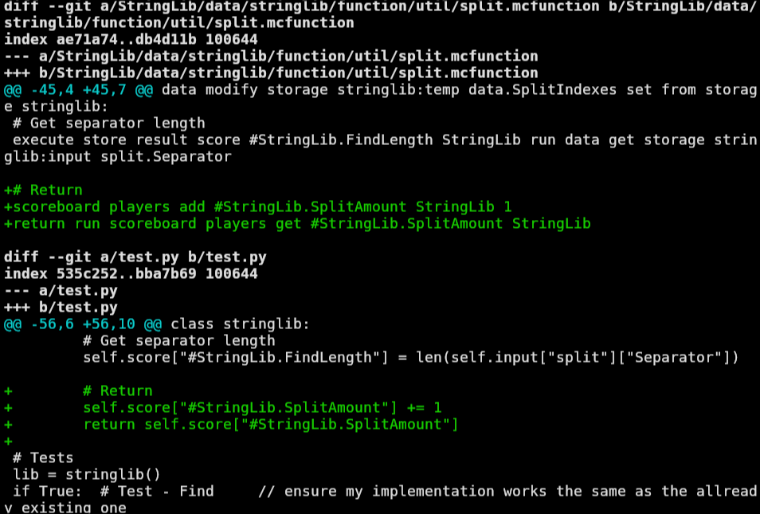
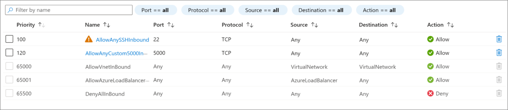

# Deploy a flask program

## Assignment
The teacher gave us an assignment to deploy a python program using Flask on a virtual machine on the Azure portal.\
The program doesn't really matter, a simple "Hello World" is enough, the goal is to deploy it.

## Steps
1. [Create a security group](#1-create-a-security-group)
2. [Create a virtual machine](#2-create-a-virtual-machine)
3. [Configure the virtual machine](#3-configure-the-virtual-machine)
4. [Deploy the program](#4-deploy-the-program)
5. [Access the program](#5-access-the-program)

## 1. Create a security group
First, we need to create a security group to control the incoming and outgoing traffic.\
I went on the [Azure portal](https://portal.azure.com/) in my resource group and clicked on "Create" to create a new resource.\
I searched for "Network Security group" and clicked on "Create".

Once created, I went to the "Inbound security rules" section and added 2 rules:
- One to allow the incoming traffic on the port 20 (SSH), this is necessary to connect to the virtual machine with SSH in order to configure it.
- One to allow the incoming traffic on the port 5000 (the default port for Flask), this is necessary to access the program.


## 2. Create a virtual machine
Now that the security group is created, I had to create a virtual machine.\
I created a new resource and searched for "Virtual machine".\
I clicked on "Create" and filled the form:
- I chose a Debian image
- I took the smallest size available
- I chose the security group I created earlier
- I opened the port 20 and 5000
- I chose a username (rignchen)
- I copied my public SSH key to connect to the virtual machine
```
cat ~/.ssh/id_ed25519.pub | copy
```

## 3. Configure the virtual machine
Once the virtual machine is created, I copied it's public IP address and connected to it with SSH.
```
ssh rignchen@51.107.18.223
```

Once connected, I started by updating my packages and configuring my development environment.
```
sudo apt update
sudo apt install git

git clone "https://github.com/Rignchen/dotfiles.git"
cd dotfiles
./install.sh
```

Once my environment was configured, I installed python, venv and Flask.
```
sudo depot i -y python3 python3-venv python3-flask
```

## 4. Deploy the program
I created a new directory for my program and created a file named `main.py` with the following content:
```python
from flask import Flask

app = Flask(__name__)

@app.route("/")
def hello_world():
    return "<p>Hello, World!</p>"
```

On the website of the Flask documentation, they said to start a virtual environment
```
python3 -m venv venv
. .venv/bin/activate
```

I then started the program with the following command:
```
flask --app main run --host 0.0.0.0
```

## 5. Access the program
Now that the program was running, I opened my browser on the website opened on the port 5000 of the virtual machine.
```
firefox "http://51.107.18.223:5000"
```

The program was running and I could see the "Hello, World!" message.



